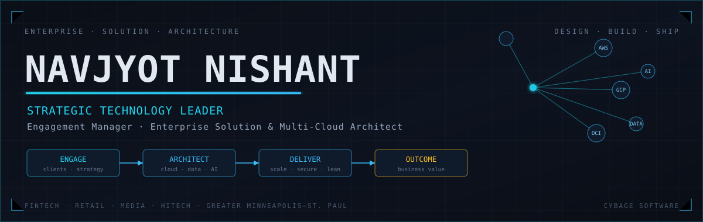

<!-- Header banner -->

 

---

### 👋 About

> **Engagement Manager & Enterprise Solution Architect** at Cybage,
> hands-on with the code. Databases in 2008, and I kept following the
> hard part upward: distributed systems, multi-cloud, and now the AI layer.

A bit of what I work with, hands-on:

- 🛠️ **Automation** &nbsp;`Go` and Python tooling, Boto3 monitoring, in-house scripts against cloud DevOps APIs, IaC pipelines. If a task repeats, I script it away.
- 🤖 **AI** &nbsp;writing `MCP servers`, governed multi-agent delivery systems, and agentic workflows; building gold-tier data for AI/ML.
- 🗄️ **Databases** &nbsp;zero-downtime migrations across `Oracle` `MSSQL` `MySQL` `PostgreSQL` `Cassandra`; HA/DR, tuning, and VLDB work hands-on.
- ☁️ **Cloud** &nbsp;`AWS` · `GCP` · `OCI`, data platforms on `Databricks` · `Redshift` · `BigQuery` · `Snowflake` · `Kafka`.

I like staying close to the build; the architecture I hand a team is usually something I've prototyped first. Most of what's here is **built after hours**, a night-time builder's habit. And when I step away, **my agents keep going**, working through the tasks I've handed them while I'm elsewhere.

Sometimes I write it down → [Medium](https://medium.com/@navjyotnishant) · [dev.to](https://dev.to/navjyotnishant)

📍 Minneapolis–St. Paul

---

### 🛠️ Stack

---

### 📊 GitHub

---

### 🚀 Featured

| Project | What it is |
|---|---|
| **[specter-agent](https://github.com/navjyotnishant/specter-agent)** | Governed multi-agent delivery workflows: design, run, approve, audit from one workspace. FastAPI + React. |
| **[Relayent](https://github.com/navjyotnishant/Relayent)** | Job broker that runs AI jobs on a machine's CLI subscription. Multi-tenant relay + bridge, in Go. |
| **[nj-agents](https://github.com/navjyotnishant/nj-agents)** | SDLC AI-agent toolkit: skills + agents across the whole software lifecycle. |
| **[mcp-server-salesforce](https://github.com/navjyotnishant/mcp-server-salesforce)** | MCP server for AI assistants to work with Salesforce orgs: Apex, SOQL, metadata. |

---

